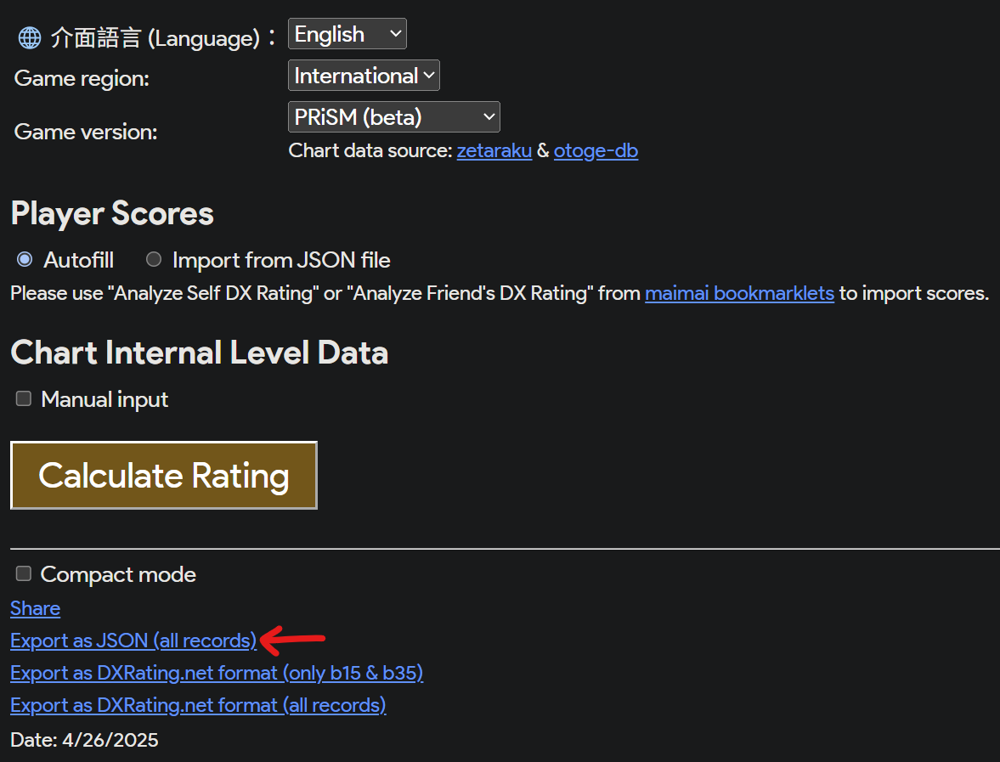
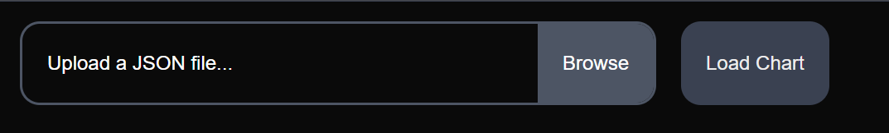

# maitools-json-to-rating-chart

English | [繁體中文](README_TW.md)

# Description

This is a tool for converting JSON data into a rating chart. It is designed to be used with the [mai-tools](https://github.com/myjian/mai-tools).

# How to use

1. Use the mai-tools to analyze your rating
2. Click on the "Export as JSON (all records)" button
   
3. Back to maimaiDX NET, copy your Friend Code, and paste it into the "Friend Code" field
4. Upload JSON file
5. Click on the "Load Chart" button
   
6. The generated chart can be found at the bottom of the page for downloading
