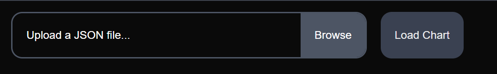

# maitools-json-to-rating-chart

[English](README.md) | 繁體中文

# 說明
這是一個將 JSON 資料轉換成 rating 圖表的工具。它是為了配合 [mai-tools](https://github.com/myjian/mai-tools) 使用而設計的。

# 使用方式
1. 使用 mai-tools 分析你的 rating
2. 點擊 "Export as JSON (all records)" 按鈕

3. 上傳 JSON 檔案
4. 點擊 "Load Chart" 按鈕

5. 在下方圖片按右鍵選擇複製或儲存圖片